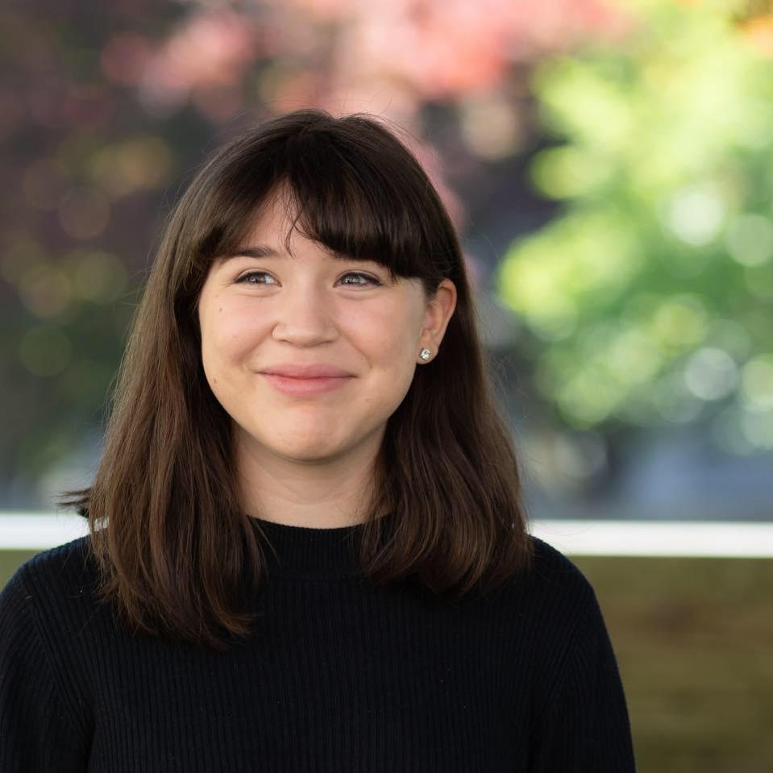
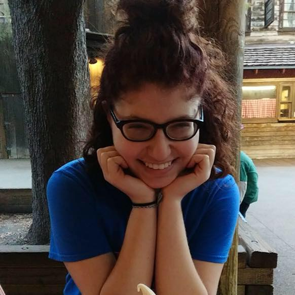
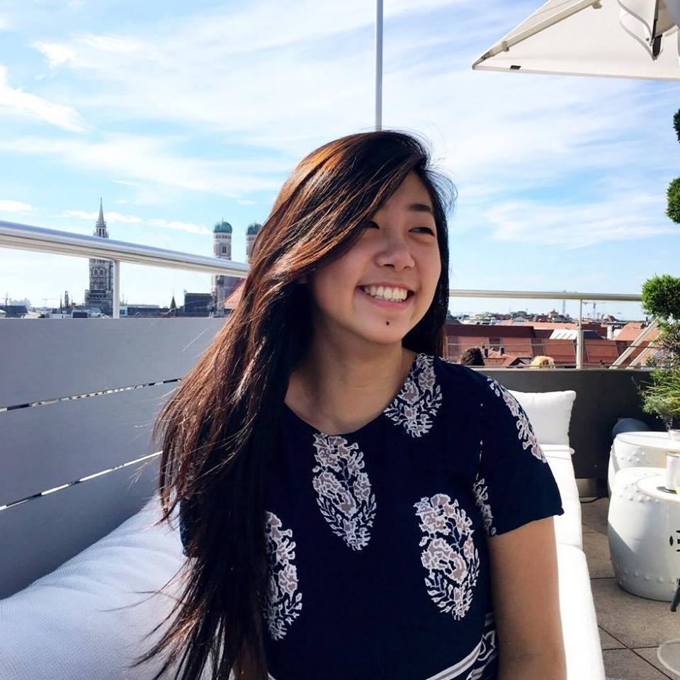

# ABOUT US

**We are three college students, 2 from Olin College of Engineering and 1 from Babson College that are working together on a final class project! If you had to describe us in two words it would be weird and cute (just like our game). We had a blast working, eating, and struggling together.**

### Thank you for visiting our website and we hope you enjoy the game!

&nbsp;

# MEET THE TEAM!

## **Sabrina Pereira**

Sabrina is a huge fan of turtlenecks and Shakira. She wakes up looking like she just put on make up. She likes... videogames? And this is kind of off topic but she does not get why people like spicy food when it just burns their mouths HOWEVER she really likes sour food. One day she is going to finally be happy, and it will be a good day.

## **Sophie Schaffer**

Sophie is a lover of raspberries and musicals. Her favorite animal is a puppy cat. She likes to work on finicky graphics problems and is quite the perfectionist when it comes to video games (apparently). All she wants to do right now is eat some chocolate and take a nap.

## **Cynthia Yong**

Cynthia is an avid fan of fresh smelling candles and organic hair products. While she loves practicing yoga and going hiking during her free time, she definitely loves to eat 24/7. She considers eating her favorite hobby. Eventually, her ultimate goal is to grow her own food and be an incredible plant mom!

&nbsp;

# SPECIAL THANKS TO...

**All the losers who tested our game and gave us amazing feedback!**

**Ben Hill, Peter Segar, Ashley Swanson, Vivien Chen for their patience and continuous feedback throughout the entire project!**

**Doki Doki Literature Club, Undertale, and Can Your Pet for the game inspo. We couldn't have done it without your amazing work!**
