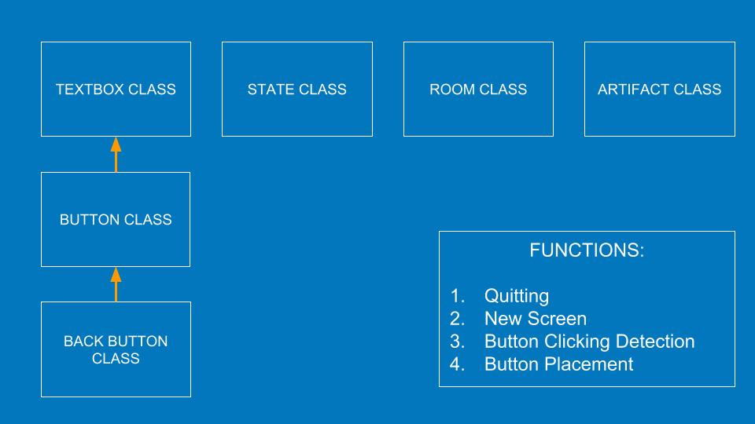

| [Home](index.md) 	| [Project Evolution & Game Architecture](gamearc.md) 	| [About Us!](aboutus.md)

&nbsp;
&nbsp;

# Code Progress and Architecture

## In the beginning...

&nbsp;

Our current code design is divided into 3 different sections:

## **MODEL**

This file contains all the critical classes that provide information to the Viewer and Controller file so the game can be displayed.

| CLASSES & FUNCTIONS 	| WHAT IT DOES                                                                                                        	|
|:---------------------	|:---------------------------------------------------------------------------------------------------------------------	|
| Stage Class         	| Stores information about the rooms/screens that will be used to generate the visuals                                	|
| State Class         	| Stores information about player progress to advance plot                                                            	|
| MappingObject Class 	| This links screens to one another. It contains the text for the buttons on the screen and the stages that come next 	|
| Decision Functions  	| Series of functions that allow the player's choices to affect what part of the game they will be shown.             	|

&nbsp;

## **VIEWER & CONTROLLER**

This file has the classes and functions that form the graphics of our game.

| CLASSES & FUNCTIONS  	 | WHAT IT DOES                                                                                                                                                      	|
|:---------------------- |:-------------------------------------------------------------------------------------------------------------------------------------------------------------------	|
| Textbox Class        	 | This is used to display the plot descriptions onto the screen                                                                                                     	|
| Button Class         	 | This class inherits from the Textbox class and is used to display interactive buttons onto the screen                                                             	|
| Screen Class         	 | This class takes information from a Stage and State object. It can then store and generate textboxes,buttons and a background to be displayed for the user to see 	|
| Controller Functions 	 |  This section contains a series of functions that detect user mouse interactivity with the game and decides what should be done with the option selected           	|

&nbsp;

## **GAME DATA**

This file stores all of our game data so the game can be personalized. The first two are essentially the blue print and this forms our actual game. It contains mainly all of the *stage* classes from Model.
