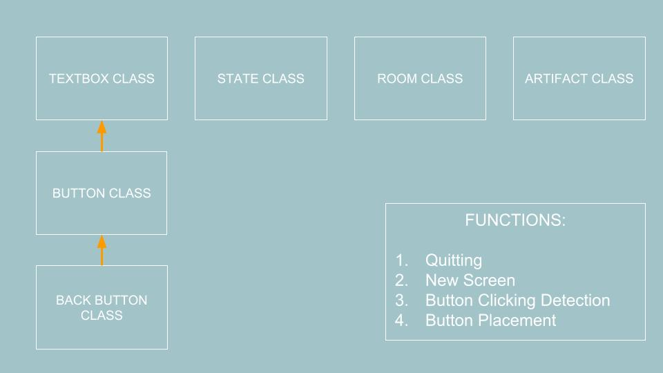
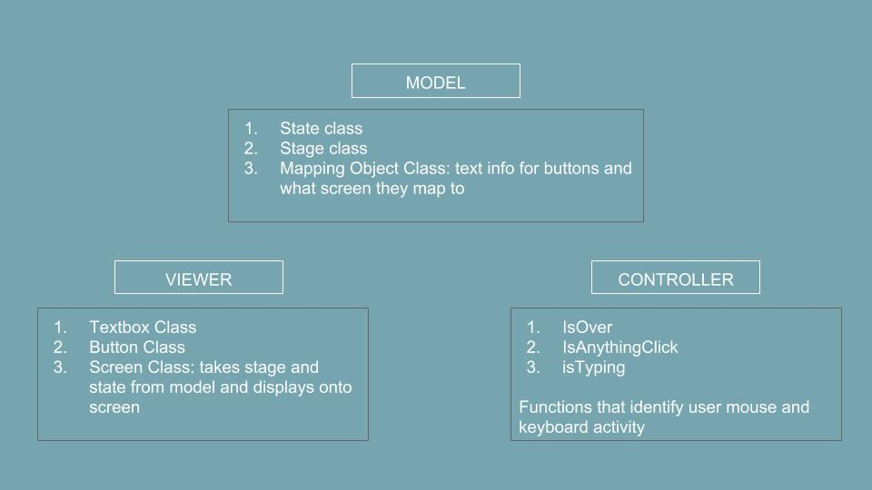
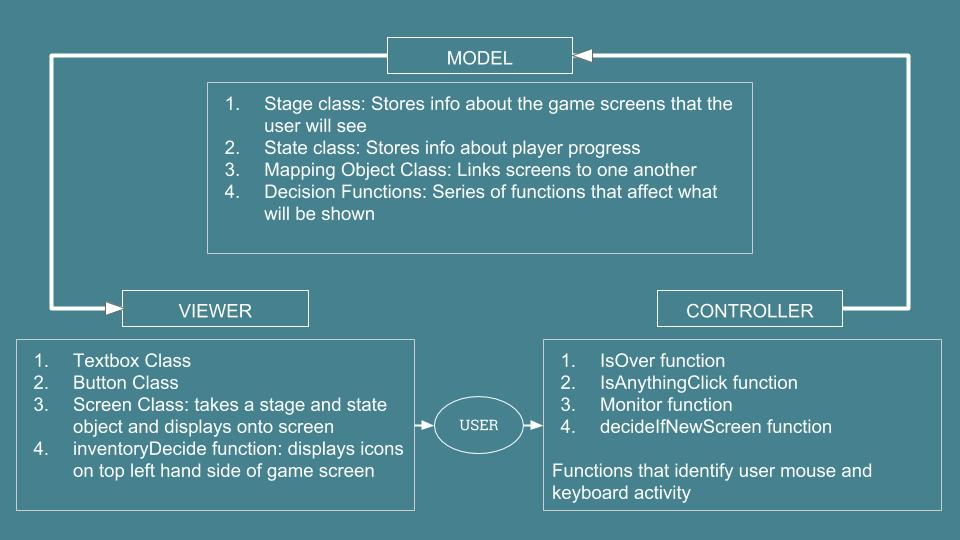

| [Home](index.md) 	| [Project Evolution & Game Architecture](gamearc.md) 	| [About Us!](aboutus.md)

&nbsp;
&nbsp;

# Code Progress and Architecture

## In the beginning...we really didn't know what we were doing...

### Initial Architecture:

When we first began, we wanted to have as little classes as possible. This was because we didn't want to start off overcomplicating the various components involved and accidentally implement unnecessary classes and functions that we wouldn't need later on.

Needless to say, we had too little classes and essentially no architecture. We were also confused ourselves as to how the classes worked with one another because we hadn't done much coding yet. One of the biggest pieces of feedback we received during our first architectural review session was to implement a "state machine" to help us keep track of the game as it progresses. We hadn't thought of the idea because we were too focused on oversimplifying the game. Additionally, we had all of our code in one giant file with no clear distinction between each class and how they work with one another. This was a huge red flag, and we are thankful that we immediately fixed the structure after we got feedback.

&nbsp;

## After splitting the code into three parts and developing an MVP, we were in much better shape!

### Improved Architecture:

Now that we had split our code into Model, Viewer, and Controller, it was significantly easier and clearer for us to discuss the relationships between class and effectively decide which functions/methods were necessary to add.

During our second architectural review, we received positive feedback about our structure. We mainly wanted to focus on figuring out an effective way to store our game data without it being overly complicated and confusing.
We received many comments about storing the data into a dictionary. However, rather than storing the data in a dictionary, we decided to create classes in model that would store our data instead.

&nbsp;

## Finally, our current code design is divided into 3 different sections:

### Final Architecture:

## **MODEL**

### This file contains all the critical classes that provide information to the Viewer and Controller file so the game can be displayed.

&nbsp;

| CLASSES & FUNCTIONS 	| WHAT IT DOES                                                                                                        	|
|:---------------------	|:---------------------------------------------------------------------------------------------------------------------	|
| Stage Class         	| Stores information about the rooms/screens that will be used to generate the visuals                                	|
| State Class         	| Stores information about player progress to advance plot                                                            	|
| MappingObject Class 	| This links screens to one another. It contains the text for the buttons on the screen and the stages that come next 	|
| Decision Functions  	| Series of functions that allow the player's choices to affect what part of the game they will be shown.             	|

&nbsp;

## **VIEWER & CONTROLLER**

### This file has the classes and functions that form the graphics of our game.

&nbsp;

| CLASSES & FUNCTIONS  	 | WHAT IT DOES                                                                                                                                                      	|
|:---------------------- |:-------------------------------------------------------------------------------------------------------------------------------------------------------------------	|
| Textbox Class        	 | This is used to display the plot descriptions onto the screen                                                                                                     	|
| Button Class         	 | This class inherits from the Textbox class and is used to display interactive buttons onto the screen                                                             	|
| Screen Class         	 | This class takes information from a Stage and State object. It can then store and generate textboxes,buttons and a background to be displayed for the user to see 	|
| Controller Functions 	 |  This section contains a series of functions that detect user mouse interactivity with the game and decides what should be done with the option selected           	|

&nbsp;

## **GAME DATA**

### This file stores all of our game data so the game can be personalized. The first two are essentially the blue print and this forms our actual game. It contains mainly all of the *stage* classes from Model.

&nbsp;

## Moving Forward:

* We would definitely like to expand the plot by adding more rooms and making it longer.

* We would also spend more time on enhancing user experience by adding better graphics and other special effects.

* We also want to include more decisions for the users to select to make the game more robust and to make the impact of their decisions more apparent in the end.

&nbsp;

## BONUS: A piece of our code that we are really proud of deals with the visual and interactivity of our lovely, pink buttons!
