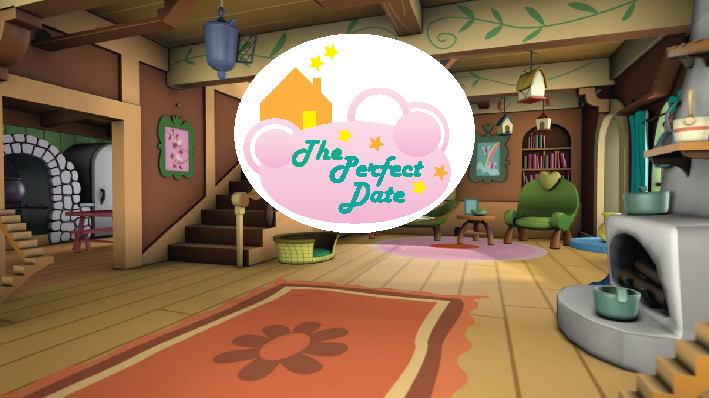

| [Home](index.md) 	| [Project Evolution & Game Architecture](gamearc.md) 	| [About Us!](aboutus.md)

&nbsp;
&nbsp;

# THE GAME INSPIRATION

We came together because of a class project. As different levels of video game fanatics, we had a wide collection of video games under our belts. However, we instantly fell in love with the idea of developing a text-based video game with a twist. With different learning goals in mind, we set out on an adventurous journey to see what we can do with python to bring this fantastic video game to life!

# CURIOUS ABOUT HOW THE GAME WORKS? CHECK OUT THIS VIDEO!
[Go to Video!](https://www.youtube.com/watch?v=7IkMg99j7lA&feature=youtu.be)

<!--  -->


&nbsp;

# HOW TO PLAY

## To get started, please download:

### PYGAME: This is needed so the game display can be generated.

```
pip install pygame
```

## First, clone the repository onto your local drive:

```
git clone https://github.com/sd18fall/ThePerfectDate
```

## Then, to **PLAY**, please run:

```
python ViewerandController.py
```

&nbsp;

# FREQUENTLY ASKED QUESTIONS

**Q: How long is the game?**

A: ~ 10 - 15 minutes

&nbsp;

**Q: Will it require a lot of skill to play?**

A: Nope! It's a text-based game, so you just read what is displayed and click on buttons with your mouse to proceed forward.

&nbsp;

**Q: Are there multiple endings?**

A: Yes! Depending on the options you select!

&nbsp;

**Q: Is it fun?**

A: OF COURSE! DUH.

&nbsp;

**Q: This game is amazing! How do I generate my own version?**

A: GLAD YOU ASKED. You can simply go into our "stageobject_mappings.py" file and you can edit the game plot in there!

&nbsp;

## WARNING: NOT INTENDED FOR THE EASILY DISTURBED.
